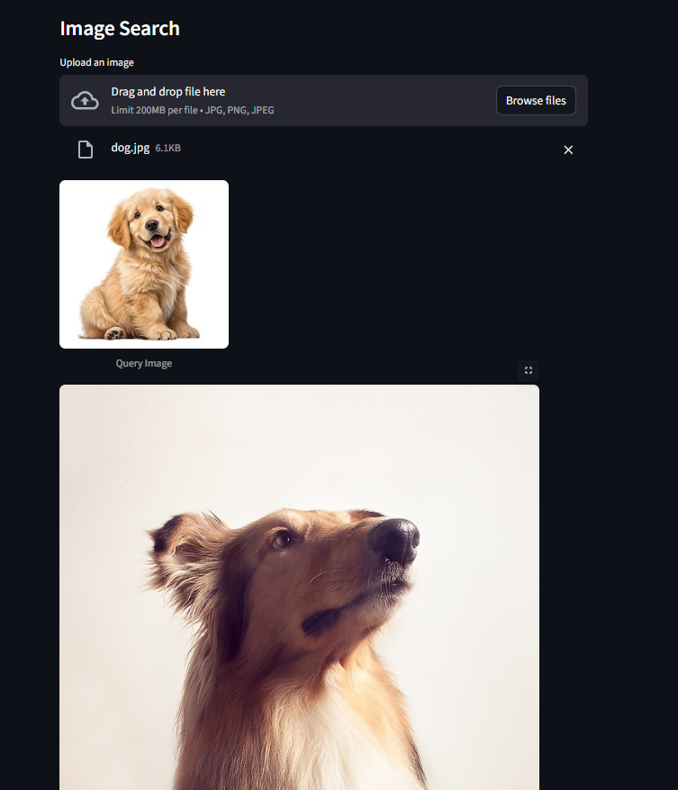

# 🔍 Multimodal Image Search System

A full-stack multimodal search engine that retrieves relevant images using both **natural language queries** and **image inputs**.
The system uses **CLIP embeddings** and **FAISS vector similarity search** to perform semantic retrieval beyond traditional keyword matching.

---

## 🚀 Features

* 🔎 **Text-to-Image Search**

  * Search images using natural language prompts like:

    * *"a dog running in a park"*
    * *"red sports car on road"*

* 🖼️ **Image-to-Image Search**

  * Upload an image to retrieve visually similar images

* ⚡ **Fast Similarity Search**

  * Uses FAISS for efficient nearest-neighbor vector retrieval

* 🧠 **Shared Embedding Space**

  * CLIP maps both text and images into the same semantic vector space

* 🌐 **Full-Stack ML Architecture**

  * FastAPI backend for inference and retrieval
  * Streamlit frontend for interactive search UI

---

# 🧠 System Architecture

```text
Frontend (Streamlit)
        ↓ HTTP Requests
Backend (FastAPI)
        ↓
CLIP Encoder (Text / Image)
        ↓
FAISS Vector Index
        ↓
Top-K Similar Results
```

---

# 🛠️ Tech Stack

## Machine Learning

* PyTorch
* OpenAI CLIP
* Hugging Face Transformers

## Vector Search

* FAISS

## Backend

* FastAPI
* Uvicorn

## Frontend

* Streamlit

## Utilities

* NumPy
* Pillow (PIL)
* Requests

---

# ⚙️ How It Works

## Step 1 — Image Embedding

Images are passed through CLIP’s vision encoder to generate semantic embeddings.

## Step 2 — Vector Indexing

The embeddings are normalized and stored inside a FAISS index for efficient similarity search.

## Step 3 — Query Encoding

User queries (text or images) are encoded into the same embedding space.

## Step 4 — Similarity Retrieval

Cosine similarity is used to retrieve the most semantically relevant images.

---

# 📂 Project Structure

```text
multimodal-image-search/
│
├── backend/
│   ├── __init__.py
│   └── app.py
│
├── frontend/
│   └── app.py
│
├── data/
│   ├── embeddings.npy
│   ├── faiss.index
│   └── paths.pkl
│
├── images/
│   └── sample_images/
│
├── requirements.txt
├── README.md
└── .gitignore
```

---

# 📦 Installation & Setup

## 1️⃣ Clone Repository

```bash
git clone https://github.com/Soyam-Patra/multimodal-image-search.git
cd multimodal-image-search
```

---

## 2️⃣ Install Dependencies

```bash
pip install -r requirements.txt
```

---

## 3️⃣ Run Backend Server

```bash
uvicorn backend.app:app --reload
```

Backend runs on:

```text
http://127.0.0.1:8000
```

---

## 4️⃣ Run Frontend

```bash
streamlit run frontend/app.py
```

Frontend runs on:

```text
http://localhost:8501
```

---

# 📸 Demo

## 🔎 Text-to-Image Search


Example query:

```text
"a crowded street at night"
```

---

## 🖼️ Image-to-Image Search




---

# 📂 Dataset

The model was tested on a custom image dataset (~18k images).

Due to size constraints, the dataset and generated embeddings are not included in this repository.

You can use your own dataset by placing images inside the `images/` directory and rebuilding the FAISS index.

---

# 🧠 Key Learnings

* Built a complete multimodal retrieval pipeline
* Implemented vector similarity search using FAISS
* Understood embedding alignment between text and images
* Learned frontend-backend communication using HTTP APIs
* Worked with GPU acceleration and batching
* Handled memory optimization and indexing strategies

---

# 🚀 Future Improvements

* 🎥 Video Search Extension
* ⏱️ Timestamp-based Retrieval
* 🧠 Hybrid Search (text + image)
* ☁️ Cloud Deployment
* 📦 Scalable Vector Databases (Milvus / Pinecone)

---

# 📬 Contact

**Soyam Patra**

📧 [soyampatra3@gmail.com](mailto:soyampatra3@gmail.com)

🔗 GitHub: https://github.com/Soyam-Patra
